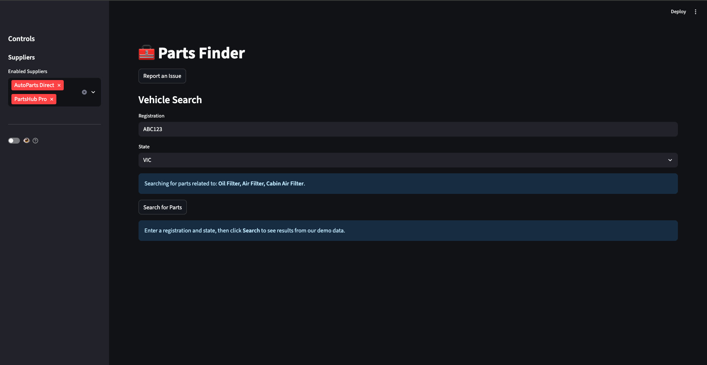
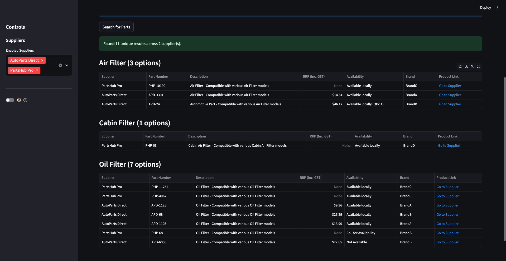
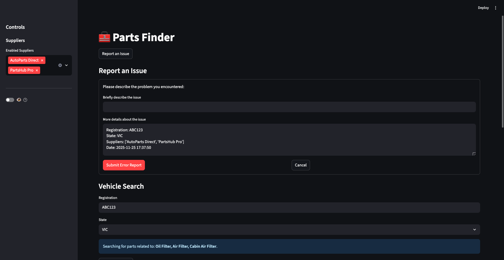

# 🧰 Parts Finder - Demo

A portfolio demonstration of a multi-source price comparison and aggregation application built with **Python** and **Streamlit**.

> **Note:** This is a demo application showcasing UI/UX design and data handling capabilities using anonymized sample data. No real supplier data is used.

## 🎯 Overview

Parts Finder is a web application that aggregates automotive parts pricing and availability from multiple suppliers, providing users with a unified comparison view. This demo showcases the technical implementation without exposing sensitive supplier information.

## 🚀 Live Demo

[Coming Soon - Streamlit Cloud deployment]

## 📸 Screenshots

### Initial Interface
Clean, intuitive UI with supplier selection and search input.



### Search Results
Multi-supplier results aggregated and sorted by availability and price, grouped by part category.



### Issue Reporting
Built-in feedback system for users to report problems with automatic context capture.



## ✨ Features

This demo application demonstrates:

- **Multi-Source Data Aggregation** - Parallel data fetching from multiple sources using `asyncio.gather()`
- **Data Normalization** - Unified schema across different supplier data formats
- **Intelligent Sorting** - Complex multi-level sorting (availability → price → quantity)
- **Deduplication Logic** - Smart duplicate detection across suppliers
- **Responsive UI** - Clean, professional interface with conditional rendering
- **Issue Reporting** - Built-in feedback system for user-reported problems
- **Session Management** - Stateful search and results handling

## 🛠️ Tech Stack

- **Python 3.x** - Core application logic
- **Streamlit** - Web UI framework
- **Pandas** - Data manipulation and analysis
- **asyncio** - Asynchronous programming for concurrent operations

## 📋 Key Technical Highlights

### Async Data Retrieval
```python
# Demonstrates concurrent data retrieval from multiple sources
async def run_all_retrievals_async():
    supplier_tasks = {
        adapter.name: asyncio.create_task(adapter.fetch_async(rego, state))
        for adapter in enabled_adapters
    }
    await asyncio.gather(*supplier_tasks.values(), return_exceptions=True)
```

### Data Normalization
- Handles varied data formats from different sources
- Maps category names to canonical forms
- Normalizes pricing, availability, and product information
- Generates sortable fields from mixed data types

### Smart Sorting Logic
1. **Availability First** - In-stock items prioritized
2. **Price Second** - Lowest cost among available items
3. **Quantity Third** - Higher stock levels preferred

## 🏃 Running Locally

### Prerequisites
- Python 3.8 or higher
- pip package manager

### Installation

1. Clone the repository:
```bash
git clone <repository-url>
cd parts_finder_demo
```

2. Install dependencies:
```bash
pip install -r requirements.txt
```

3. Run the application:
```bash
streamlit run app/app.py
```

4. Open your browser to `http://localhost:8501`

## 📁 Project Structure

```
parts_finder_demo/
├── app/
│   ├── app.py              # Main Streamlit application
│   ├── adapters.py         # Data source adapters with async support
│   ├── normalizer.py       # Data normalization logic
│   └── data/               # Anonymized sample data (JSON)
├── models/
│   └── part.py             # Data models
├── requirements.txt        # Python dependencies
└── README.md
```

## 🎨 Features Walkthrough

### 1. Supplier Selection
- Enable/disable specific suppliers dynamically
- Results update to reflect selected sources

### 2. Search Interface
- Vehicle registration and state input
- Searches for common service parts (Oil Filter, Air Filter, Cabin Filter)

### 3. Results Display
- Grouped by part category
- Sorted by availability and price
- Toggleable cost column visibility
- Product links to supplier pages

### 4. Issue Reporting
- Built-in feedback mechanism
- Captures search context automatically
- Saves reports locally for review

## 🔍 Sample Data

The demo uses anonymized sample data featuring:
- 2 mock suppliers (AutoParts Direct, PartsHub Pro)
- Generic part numbers and descriptions
- Anonymized brand names (BrandA, BrandB, etc.)
- Realistic pricing and availability patterns
- Varied stock levels to demonstrate sorting

## 💡 Skills Demonstrated

- **Python** - Object-oriented design, async/await patterns
- **Web Development** - Streamlit framework, responsive UI design
- **Data Engineering** - Normalization, deduplication, transformation
- **UX Design** - Intuitive search flow, clear data presentation
- **Software Architecture** - Modular design, adapter pattern, separation of concerns

## 📝 Implementation Notes

### Why Async for Demo Data?
While the demo loads static JSON files (which is fast), the async pattern is preserved to demonstrate:
- Concurrent programming skills
- Real-world scalability considerations
- Proper error handling in parallel operations

### Design Decisions
- **No Authentication** - Removed for public demo accessibility
- **Simplified Flow** - Focuses on core features without variant selection complexity
- **Gitignored Issues** - Issue reports saved locally, not tracked in version control

## 🚧 Future Enhancements

If this were a production application, potential additions include:
- User accounts and saved searches
- Price history tracking and alerts
- Additional part categories
- Advanced filtering options
- Export functionality (CSV, PDF)

## 📄 License

This is a portfolio demonstration project.

## 👤 Contact

Daniel Shaw
shaw.g.daniel@gmail.com
https://www.linkedin.com/in/daniel-george-shaw/
https://github.com/DanielGShaw

---

**Note:** This application demonstrates technical capabilities using anonymized sample data. It does not connect to live supplier systems.