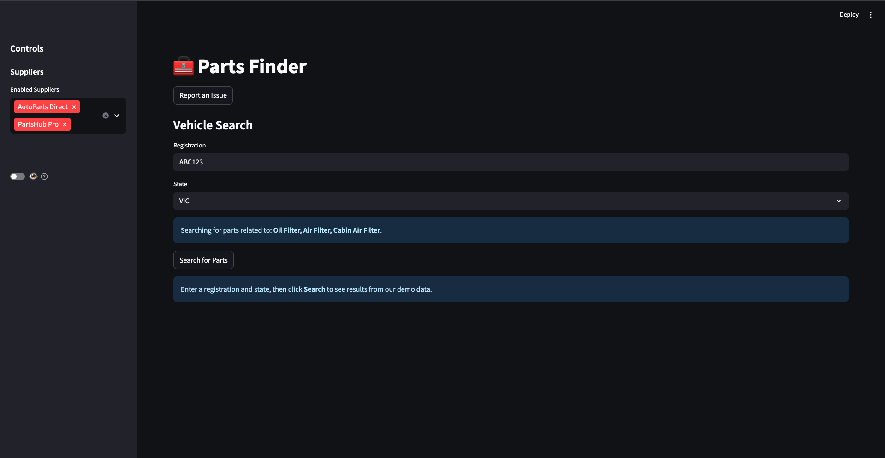
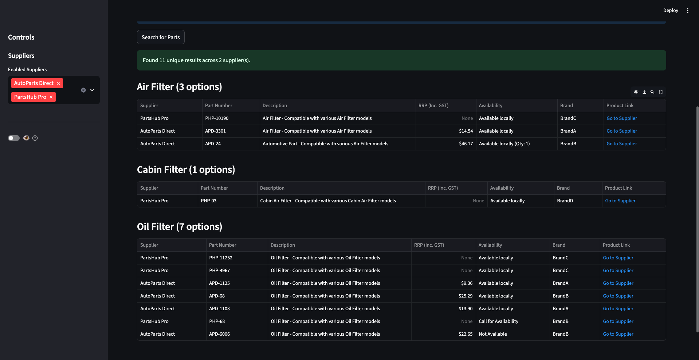
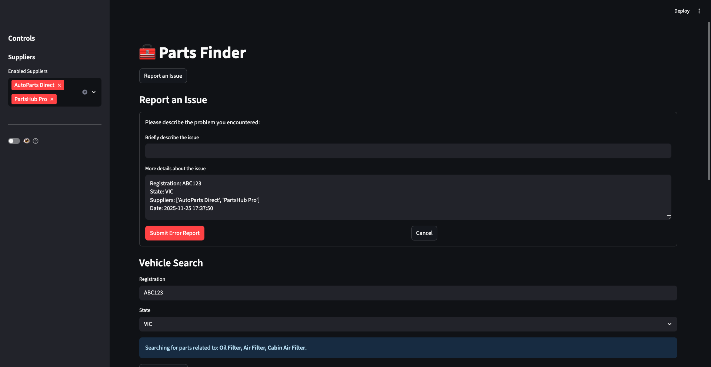

# Parts Finder

Parts Finder pulls service parts pricing and availability from multiple supplier catalogues into a single view, so a workshop can look up a vehicle once and compare what's in stock and what it costs — instead of running the same search across three supplier portals.

This repository is a demo of the UI and aggregation layer. The supplier integration code that drives the production version — session handling, catalogue scraping, and rego-to-parts lookups against real supplier websites — is not included here. The adapters in this repo read anonymized sample JSON so the app is runnable and the flow is representative, but it won't return live pricing.

## Live app

**[parts-finder-demo on Streamlit Cloud](https://parts-finder-demo-htxbunb8l7pbbmzjdqukyw.streamlit.app/)**

Runs on the sample data: two mock suppliers, generic part numbers, placeholder brands. Sorting, grouping, and UI match the internal build.

## Screenshots

### Search



Enter rego and state, pick which suppliers to hit.

### Results



Grouped by part category and sorted: in-stock first, then price, then quantity on hand. The cost column toggles off when a customer is looking at the screen.

### Issue reporting



One-click report when a lookup returns the wrong part or a supplier result looks off. Search context is captured automatically.

## How it works

- Supplier adapters fetch in parallel via `asyncio.gather`, so total latency is the slowest supplier, not the sum.
- A normalizer maps each supplier's schema onto a shared part model — category names, pricing shape, availability flags, stock counts.
- Deduplication runs across suppliers so the same part from two sources collapses into one row with both prices visible.

In production, the adapters hit supplier websites directly and handle auth, session state, and catalogue quirks per supplier. In this demo, the same adapter interface loads static JSON fixtures instead.

## Running locally

```bash
pip install -r requirements.txt
streamlit run app/app.py
```

Then open `http://localhost:8501`.

## Layout

```
parts_finder_demo/
├── app/
│   ├── app.py              # Streamlit entrypoint
│   ├── adapters.py         # Supplier adapters (sample-data version)
│   ├── normalizer.py       # Cross-supplier schema mapping
│   └── data/               # Sample supplier JSON
├── models/
│   └── part.py
└── requirements.txt
```

## Contact

Daniel Shaw
shaw.g.daniel@gmail.com
https://www.linkedin.com/in/daniel-george-shaw/
https://github.com/DanielGShaw
